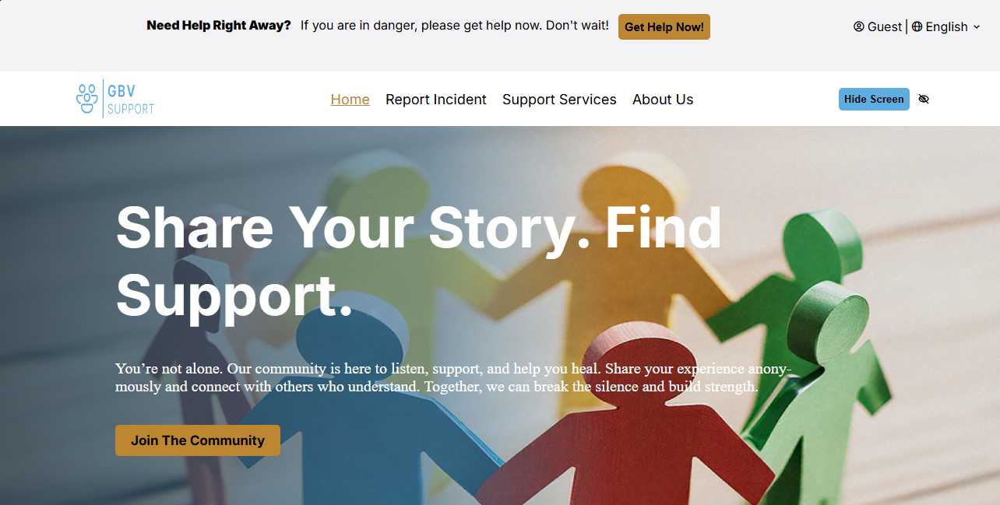

# GBV-web-app-project

## Overview:

This project aims to create a secure web platform for victims of gender-based violence in Nigeria to anonymously report incidents. It will offer resources like emergency contacts, legal aid, and safety tips, while prioritizing user privacy. The goal is to discreetly empower users with access to help and support without fear of exposure.

## Features:

- Anonymous incident reporting
- Emergency contact hotlines
- Legal aid resources
- User registration (email-based) for program updates
- Future programs and services (coming soon)

## Deployment

- The application is deployed on Render and accessible at https://gbv-web-app-project.onrender.com/
- Click [here](https://docs.google.com/document/d/1yu53284IZz97YDRLCJfacs7UoI3pRjHUcpwKBmKAn_o/edit?usp=sharing) to view the brief Reaserch Documentation.

## Contributing

To contribute to this project:

1. Fork the repository
2. Create a new branch (`git branch feature/your-feature`)
3. Download the `requirements.txt` file
4. Make changes and commit (`git commit -m "Your feature description"`)
5. Push to the branch (`git push origin feature/your-feature`)
6. Submit a pull request

## Milestones

- *Milestone 1: Getting Started* - Project setup and initial planning
- *Milestone 2: Page Completion* - Completion of web pages
- *Milestone 3: Finalization* - Finalizing web pages and preparation for deployment
- *Milestone 4: Deployment* - Successful deployment on Render

## Acknowledgements

We would like to thank:

- [Name] for their contributions to the project
- [Organization] for their support and resources
